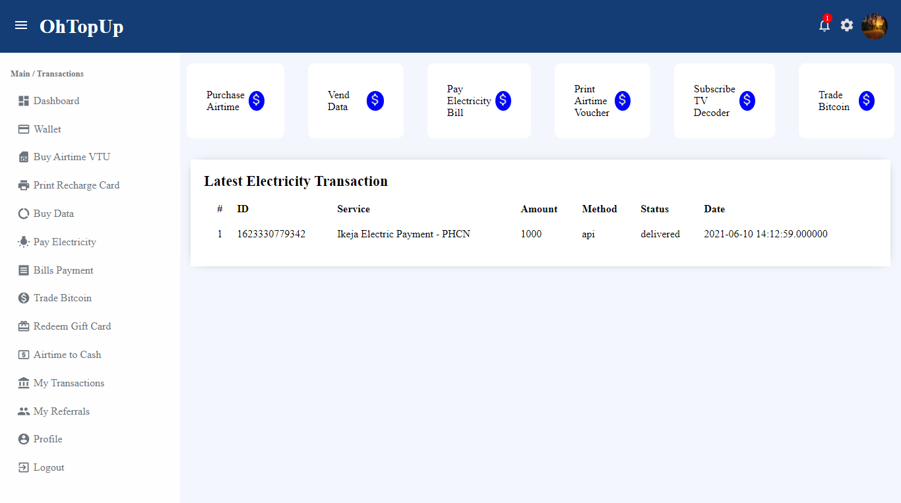
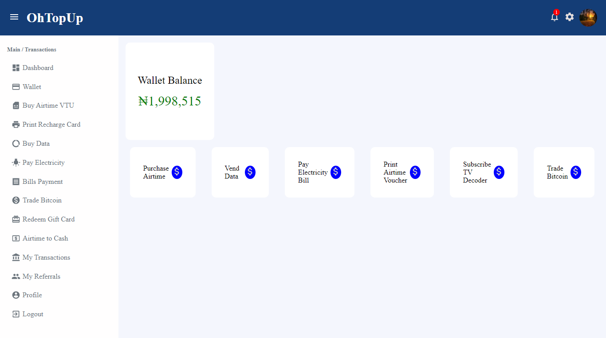
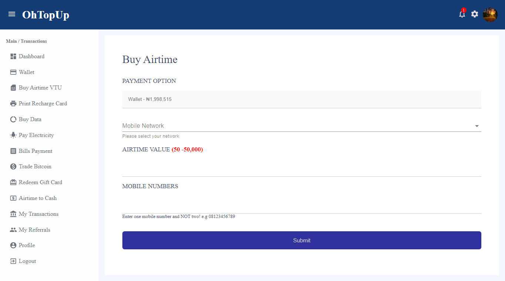
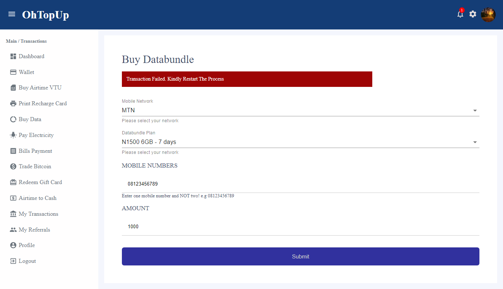
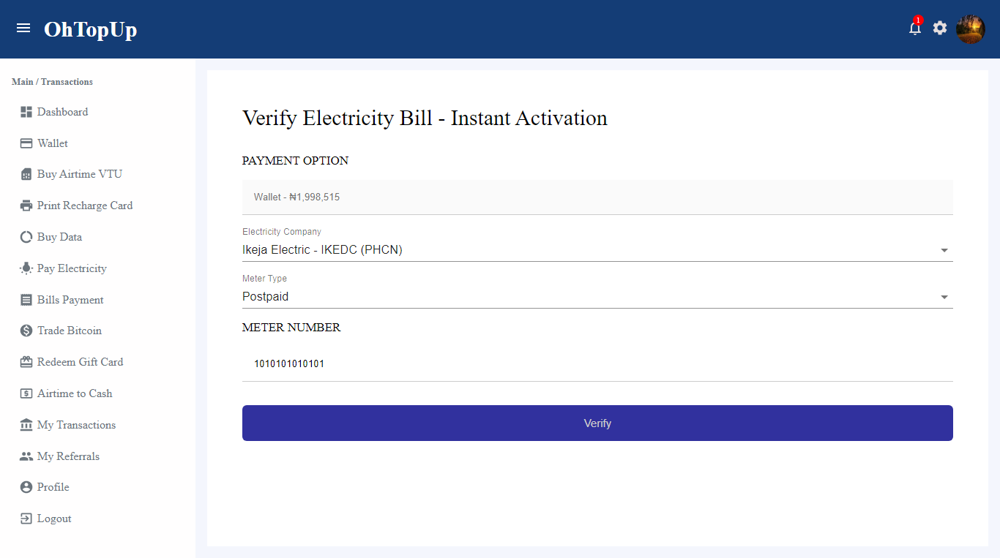
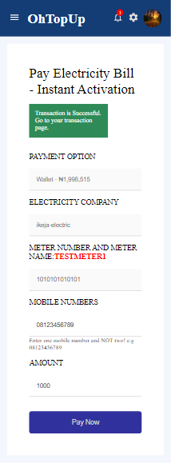
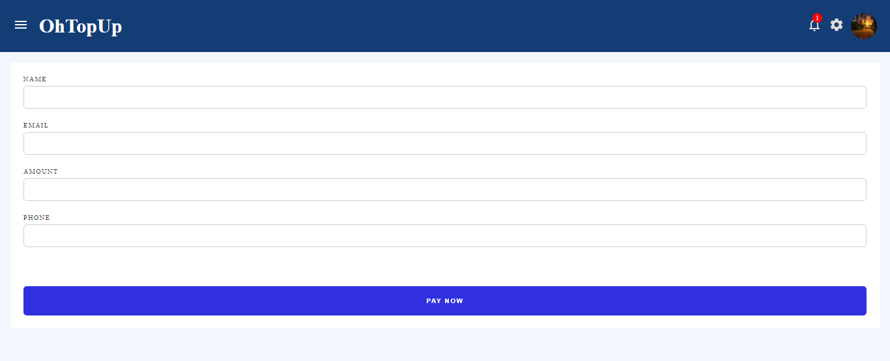

# OhTopUp: Automated Subscribe Decoder & Data, Airtime and Electricity Purchase

This project is a React application used basically for the automated transaction of airtime, data, electricity purchase alongside bank transfer. This is a development project and not for production for now, which means all transactions you will make with this web app result from fake transactions that wouldn't work in real-time. For now, this is a one user web app which means you use one user's credential to access all features.

## Languages & Technologies Used

⭐ HTML
⭐ CSS
⭐ React
⭐ Git
⭐ Netlify

## Functionalities / Pages

👉 Dashboard Page: Here is a preview of it on desktop  

👉 Wallet Page: 
 
👉 Buy Airtime Page: 
 
On Sandbox, test phone number: 08011111111

To simulate a failed transaction, please use any number apart from the one provided above as phone number. 
👉 Buy Data Page: 
 
👉 Verify Electricity Page: For the customer to be on the safer side it was needed to create a verify meter number route to verify his meter number. The functionality here is whether there be any error an error message will be thrown and the customer will not be able to redirect to the "Pay Electricity Page" 
 
👉 Pay Electricity Page: For successful validation of credentials this page will finalize the electricity bill purchase 
 
👉 Payment Integration Page: With the aid of PayStack Transaction API payment integration was made easy but as of this web app my personal credential to access the usage of their services was removed because backend (nodejs) is yet to be developed by me. 
 
👉 Transaction Page: Material UI's Table Components was used to make the table of fetched fake data users.  
Other pages are yet to be created but the full idea of payment integration was used in this web app.

Feel free to connect with me on

[Twitter](https://twitter.com/obubuoge)

[LinkedIn](https://linkedin.com/in/oge-obubu)

## Fork this project

Feel free to enhance this project and make it yours.

After downloading the clone version, ensure you install all dependencies using

### `npm install` or `yarn add`

## Available Scripts

In the project directory, you can run:

### `yarn start`

Runs the app in the development mode.\
Open [http://localhost:3000](http://localhost:3000) to view it in the browser.

The page will reload if you make edits.\
You will also see any lint errors in the console.
